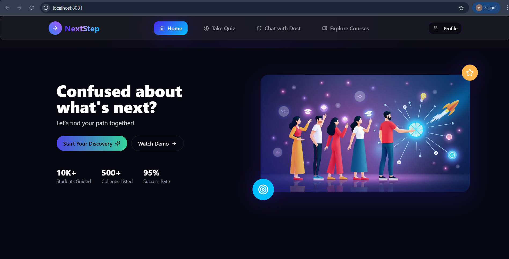
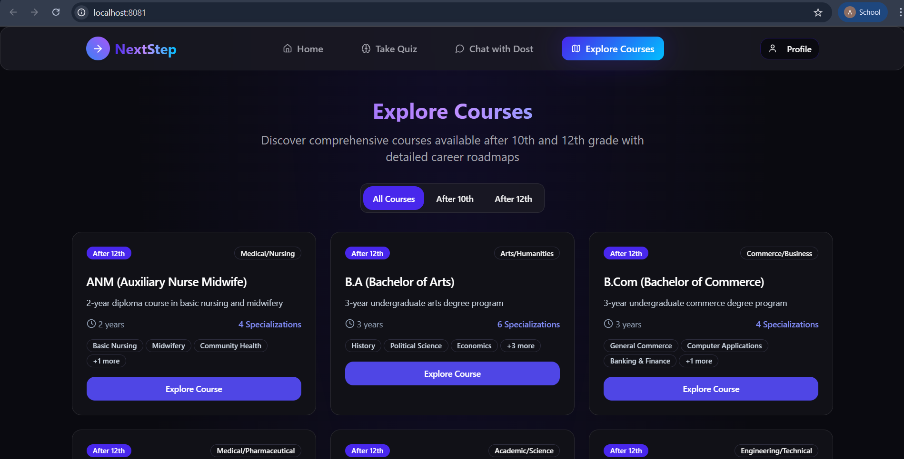
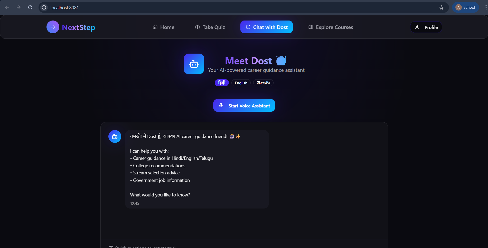

# NextStep

A modern career guidance platform built with **Vite + React + TypeScript**, styled with **TailwindCSS** components.  
The app integrates AI-driven features, course exploration, and interactive tools to guide students in choosing the right career path.

---

## ✨ Features
- ⚡ Fast development with **Vite + React + TypeScript**  
- 🎨 UI powered by **TailwindCSS**  
- 🔍 Career quiz & recommendation system  
- 📚 Course & institution exploration  
- 🎤 AI-powered voice assistant (via `@vapi-ai/web`)  
- 💬 Real-time chatbot for career queries  
- 🗂 Supabase integration for data & authentication  
- 📊 Data visualization with **Recharts**  
- 🌗 Dark mode support with **next-themes**  

---

## 📦 Tech Stack
- **Frontend:** React 18, Vite, TypeScript  
- **UI/Styling:** TailwindCSS, Radix UI  
- **Routing:** React Router DOM  
- **State & Data:** React Query (TanStack), React Hook Form, Zod  
- **Database/Backend:** Supabase  
- **Other Tools:** ESLint, TypeScript, PostCSS  

---

## 🚀 Getting Started

### 1️⃣ Clone the repository
```bash
git clone https://github.com/your-username/NextStep-main.git
cd NextStep-main
```
### Install Dependencies
```bash
npm install
```
### Run the development server
```bash
npm run dev
```
By default, Vite runs on 👉 http://localhost:5173

(You can change this to another port in vite.config.ts if needed.)
### Build for production
```bash
npm run build
```
### Preview production build
```bash
 npm run preview
```
## ⚙️ Configuration

### 1️⃣ Change Development Server Port
By default, Vite runs on **5173**.  
To use a custom port (e.g., `8081`), edit **vite.config.ts**:

```ts
import { defineConfig } from 'vite'
import react from '@vitejs/plugin-react-swc'

export default defineConfig({
  plugins: [react()],
  server: {
    port: 8081, // your preferred port
  },
})
```
## 📂 Project Structure

```bash
SIHNEXTSTEP-main/
├── public/         # Static assets
├── src/            # Application source code
│ ├── components/   # Reusable UI components
│ ├── pages/        # Page-level components
│ ├── hooks/        # Custom React hooks
│ ├── lib/          # API clients, utils, helpers
│ └── main.tsx      # App entry point
├── package.json    # Project scripts & dependencies
├── tailwind.config.js  # TailwindCSS configuration
├── vite.config.ts      # Vite configuration
└── tsconfig.json       # TypeScript configuration
```
### 📸 Screenshots



